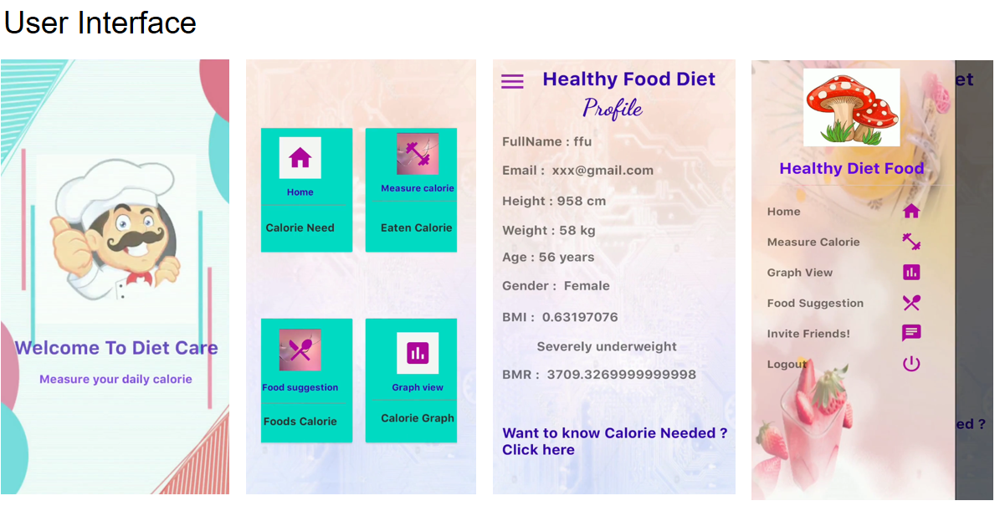

# A calorie measurement app

## Features are: 
1. Home(BMI/BMR)
2. Measure Calorie
3. Food Suggestion

## Prerequisites
* Installation of Android Studio
* Android Studio Version 3.6

## Language & Technologies used:
* JAVA
* Firebase

## App Description
Accomplished streamlined user experience as measured by enhanced user engagement and satisfaction, by developing a comprehensive Android application leveraging Java and Firebase. Integrated intuitive user interface design, admin panel for seamless management, user activity tracking, and customizable rider options.[(Details in Github)](https://github.com/mahbuba26/Diet-Care)

The custom layout of this app features a user-friendly interface designed for ease of use. It enables users to effortlessly track their daily food calories, ensuring a seamless experience for managing their dietary intake.

This layout demonstrates the functionality for measuring calorie intake, provides various food suggestions, and includes options for contacting the owner.

## App Demo
[App demo](https://github.com/mahbuba26/Diet-Care/issues/1#issue-2203955802)
